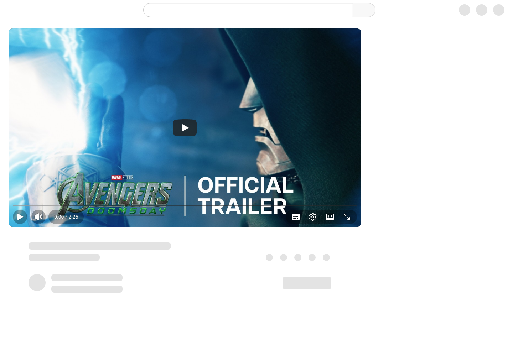
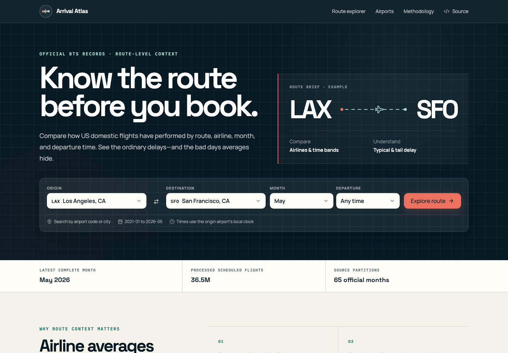
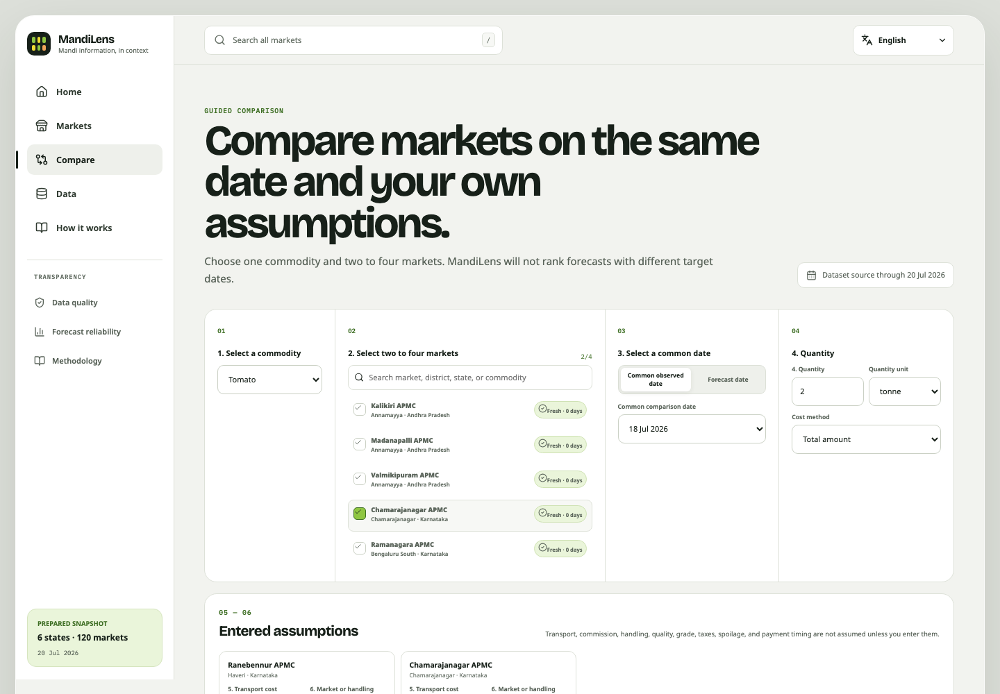
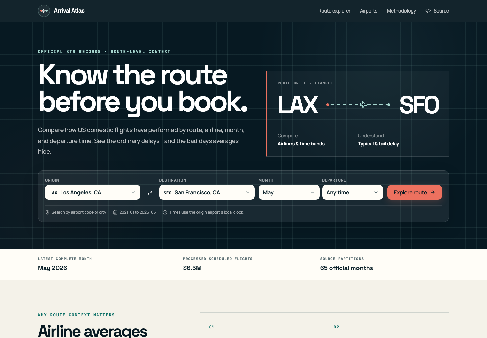
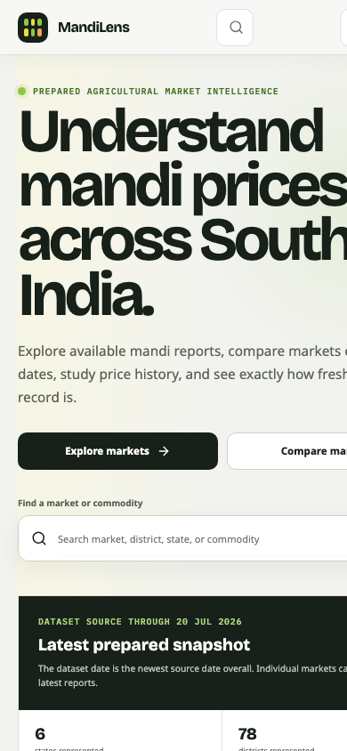
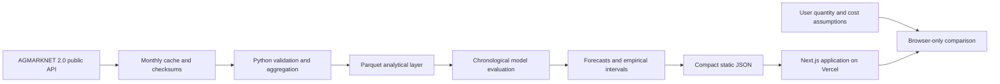

<h1 align="center">MandiLens</h1>

<p align="center">
  Mandi information, in context — observed prices, market comparisons, reporting quality,
  and carefully explained seven-day outlooks across South India.
</p>

<p align="center">
  <a href="https://mandilens.vercel.app"><strong>Live application</strong></a>
  ·
  <a href="https://mandilens.vercel.app/markets">Explore markets</a>
  ·
  <a href="https://mandilens.vercel.app/compare">Compare markets</a>
  ·
  <a href="https://mandilens.vercel.app/methodology">Methodology</a>
</p>

<p align="center">
  <a href="https://github.com/heybadrinath/MandiLens/actions/workflows/quality.yml"></a>
  
  
  <a href="CONTRIBUTING.md"></a>
</p>



MandiLens turns official but irregular AGMARKNET reports into a focused public decision-support
product. It helps farmers, Farmer Producer Organizations, traders, analysts, agritech teams, and
market researchers inspect what was reported, compare like-for-like market dates, and understand
how fresh and reliable each result is.

The product deliberately keeps observed data, estimates, and user-entered assumptions separate.
It is information only—not trading, procurement, or financial advice.

## What you can do

- Search **189 represented market-commodity series** across **120 markets**.
- Inspect observed minimum, representative, and maximum prices with historical context.
- Explore reported arrivals, seasonality, missing-report periods, and anomaly flags.
- Compare two to four markets for one commodity on a common observed or forecast date.
- Add quantity and market-specific cost assumptions without inventing hidden costs.
- Review a lead-specific seven-day outlook with explicit uncertainty and reliability context.
- Read detailed reports covering data quality, methodology, sources, limitations, and architecture.
- Use the interface in English and nine Indian languages.

## Current prepared snapshot

The deployed snapshot represents source data through **20 July 2026**.

| Measure                          | Published scope |
| -------------------------------- | --------------: |
| States                           |               6 |
| Districts                        |              78 |
| Markets                          |             120 |
| Commodities                      |              14 |
| Market-commodity series          |             189 |
| Prepared market-day observations |          91,737 |
| Source variety rows inspected    |       1,569,829 |
| Accepted variety rows            |       1,564,481 |

Represented states are Andhra Pradesh, Karnataka, Kerala, Maharashtra, Tamil Nadu, and Telangana.
The 14 commodities include vegetables, grains, oilseeds, fibre crops, spices, and plantation crops.

## Product tour

<table>
  <tr>
    <td width="50%">
      <strong>Market Explorer</strong><br><br>
      
    </td>
    <td width="50%">
      <strong>Guided market comparison</strong><br><br>
      
    </td>
  </tr>
  <tr>
    <td width="50%">
      <strong>Market history and evidence</strong><br><br>
      
    </td>
    <td width="50%">
      <strong>Responsive mobile experience</strong><br><br>
      
    </td>
  </tr>
</table>

## Forecasting and data integrity

The selected forecasting method is a validated recent-level and lead-aware blend. Candidate
methods are compared using chronological selection folds and a separate locked 60-day holdout, so
future observations cannot leak into model selection.

| Locked-holdout measure      |                       Result |
| --------------------------- | ---------------------------: |
| Forecast examples           |                      195,253 |
| Mean absolute error         |          ₹521.20 per quintal |
| WAPE                        |                       10.53% |
| Directional accuracy        |                       49.15% |
| Empirical interval coverage | 71.59% against an 80% target |

That coverage shortfall is published rather than hidden. Missing market reports also remain
missing—they are never converted into a zero price. Read the live
[forecast reliability](https://mandilens.vercel.app/forecast-reliability) and
[data-quality](https://mandilens.vercel.app/data-quality) reports for the full interpretation.

## Architecture



Forecasts are produced by a reproducible batch pipeline and published as versioned artifacts. The
web application does not need a request-time model server, database, login, or browser secret.

## Technology

| Layer                  | Main tools                                                            |
| ---------------------- | --------------------------------------------------------------------- |
| Web product            | Next.js 16, React 19, TypeScript                                      |
| Charts and interface   | Recharts, Lucide, responsive CSS design system                        |
| Data pipeline          | Python 3.12, Polars, Parquet, Pydantic                                |
| Forecasting            | scikit-learn, rolling-origin evaluation, empirical residual intervals |
| Exploration            | DuckDB                                                                |
| Quality                | Pytest, Ruff, strict mypy, Vitest, ESLint, Prettier                   |
| Automation and hosting | GitHub Actions, Vercel                                                |

## Getting started

### Prerequisites

- Node.js 24
- Python 3.12 or newer
- [uv](https://docs.astral.sh/uv/)

### Run the application

```bash
make install
make dev
```

Open [http://localhost:3000](http://localhost:3000).

Equivalent direct commands:

```bash
uv sync --all-groups --frozen
npm ci --prefix apps/web
npm run dev --prefix apps/web
```

### Useful commands

| Command          | Purpose                                                                |
| ---------------- | ---------------------------------------------------------------------- |
| `make check`     | Run formatting, linting, type checks, tests, and the production build  |
| `make download`  | Retrieve and cache configured official source partitions               |
| `make validate`  | Validate source rows and rebuild quality evidence                      |
| `make transform` | Rebuild processed and published market-day data                        |
| `make train`     | Run chronological evaluation and fit the selected method               |
| `make forecast`  | Publish lead-specific forecasts and intervals                          |
| `make refresh`   | Refresh recent source months and rebuild the complete product artifact |

The source backfill is rate-limited, cached, and restartable. A failed refresh does not replace the
last known-good published snapshot.

## Repository layout

```text
apps/web/             Next.js application and static web artifacts
config/               Pipeline, quality, model, and path configuration
data/published/       Versioned analytical datasets and manifests
models/published/     Selected model bundle and metadata
pipelines/src/        Ingestion-to-export Python package
reports/              Data-quality and model-evaluation reports
tests/                Pipeline, leakage, calculation, and artifact tests
docs/                 Architecture, methodology, cards, and screenshots
.github/workflows/     Quality gates and scheduled data refresh
```

## Contributing

Thoughtful contributions are welcome. Good starting points include documentation improvements,
accessibility fixes, clearer chart explanations, test coverage, and well-scoped data-quality bugs.

Read [CONTRIBUTING.md](CONTRIBUTING.md) before opening a pull request. For larger product, data, or
model changes, open an issue first so the scope and evidence requirements are clear.

Security concerns should follow the private reporting guidance in [docs/SECURITY.md](docs/SECURITY.md).

## Data source and responsible use

Source data comes from the Directorate of Marketing and Inspection, Ministry of Agriculture and
Farmers Welfare, Government of India:

- [AGMARKNET current daily mandi prices](https://www.data.gov.in/catalog/current-daily-price-various-commodities-various-markets-mandi)
- [Government Open Data License — India](https://www.data.gov.in/godl)

Source attribution does not imply government endorsement. Market reporting can be delayed,
incomplete, revised, or inconsistent across locations. Historical performance and forecast
intervals are not guarantees for a particular market or date.

## Repository status

This repository welcomes issues and pull requests, but a software license has not yet been
selected. Public visibility does not itself grant software reuse rights. Add an explicit `LICENSE`
before presenting the code as formally open source.
