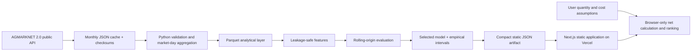

# MandiLens

> Evidence-led Maharashtra mandi intelligence: observed prices, seven-day forecast intervals,
> market comparison, and transparent estimated net realization.

- **Live application:** [mandilens.vercel.app](https://mandilens.vercel.app)
- **Source repository:** [github.com/heybadrinath/MandiLens](https://github.com/heybadrinath/MandiLens)
- **Published dataset:** [market_history.parquet](https://raw.githubusercontent.com/heybadrinath/MandiLens/main/data/published/market_history.parquet)
- **Model artifact:** [selected_model.joblib](https://raw.githubusercontent.com/heybadrinath/MandiLens/main/models/published/selected_model.joblib)
- **Data snapshot:** 1 January 2021–20 July 2026
- **Scope:** onion, potato, and tomato · 21 market/commodity series · 14 Maharashtra markets

MandiLens is a public decision-support product for farmers, Farmer Producer Organizations,
traders, analysts, agritech teams, and market researchers. It turns official but irregular mandi
reports into a focused comparison workflow without presenting a forecast as a promised price or a
ranking as financial advice.

## Why this product exists

Raw mandi data can answer “what was reported?” but not directly:

- Which selected market has the strongest current or forecast price range?
- How fresh and complete is each market’s reporting?
- Is a movement unusual relative to the market’s recent history?
- How does the answer change after my actual transport-cost assumption?
- How well did the forecasting method perform on genuinely future periods?

The highest displayed price is not automatically the best selling option. Quantity, data
freshness, uncertainty, and market-specific costs all change the comparison.

## What is implemented

- Official AGMARKNET 2.0 data retrieval with retrying, rate limiting, monthly caching, checksums,
  and a source manifest
- Explicit validation for identity, dates, numeric parsing, positive and ordered prices,
  duplicates, negative arrivals, extreme values, unresolved references, freshness, and gaps
- Variety-to-market-day aggregation with arrival-weighted modal prices when weights exist
- Robust anomaly flags that remain in the dataset rather than being silently deleted
- Coverage-led market selection: seven recent, active series per commodity
- Leakage-safe lags, rolling statistics, momentum, spread, arrivals, freshness, reporting
  frequency, seasonality, and categorical context
- Four-way chronological comparison: last observation, moving average, seasonal naive, and global
  histogram gradient boosting
- Empirical one-to-seven-day prediction intervals calibrated from prior evaluation errors
- Interactive commodity, district, market, horizon, and historical-window controls
- Observed min/modal/max range, historical chart, forecast interval, seasonal chart, movement,
  volatility, arrivals, anomalies, and missing-report context
- User-controlled quantity conversion and per-market transport-cost assumptions
- Point and low/high estimated net realization with live market ranking and CSV download
- Dedicated data-quality, model-performance, methodology, source/licensing, and limitations pages
- Static production architecture with no login, database, request-time model, or browser secret
- Weekly, fail-safe GitHub Actions refresh and Vercel deployment through committed artifacts

## Verified data-quality result

| Measure | Result |
|---|---:|
| Official monthly responses | 201 |
| Source variety-level rows | 183,174 |
| Accepted rows | 183,148 |
| Excluded rows | 26 |
| Exact duplicates excluded | 25 |
| Extreme-price exclusions | 1 |
| Published market-day observations | 32,617 |
| Selected market/commodity series | 21 |
| Distinct markets | 14 |
| Unresolved market references | 0 |
| Stale selected series | 0 |
| Robust anomaly flags retained | 2,578 |

The source does not report every market every day. Missing reports remain unknown; they are not
filled with a price of zero. See [the data-quality report](reports/DATA_QUALITY.md) and
[dataset card](docs/DATASET_CARD.md).

## Verified model result

Four 90-day future windows were evaluated with expanding chronological training history. Every
method was scored on the same 36,609 observed targets.

| Method | MAE (₹/quintal) | WAPE | sMAPE | Directional accuracy |
|---|---:|---:|---:|---:|
| **Global histogram gradient boosting — selected** | **250.67** | **13.79%** | **13.11%** | **50.21%** |
| Five-report moving average | 253.51 | 13.95% | 13.27% | 51.88% |
| Last observation | 253.52 | 13.95% | 13.34% | 23.46% |
| Seven-day seasonal naive | 348.46 | 19.17% | 17.73% | 48.63% |

The tree reduced MAE by **1.12%** versus the strongest simple baseline, narrowly clearing the
preset 1% complexity threshold. It reduced MAE by **28.06%** versus the seasonal-naive baseline.
The displayed interval targets 80% coverage and achieved **92.44% empirical coverage** on 27,340
later-fold forecasts calibrated only from earlier-fold errors.

That historical coverage is conservative, not a guarantee. Tomato remained the hardest commodity
(19.60% WAPE), versus onion (12.06%) and potato (8.02%). See the
[full evaluation report](reports/MODEL_EVALUATION.md) and [model card](docs/MODEL_CARD.md).

## Architecture



The batch boundary is deliberate. Forecasts depend on commodity, market, and horizon—not on
request-time private features—so a continuously running Python API would add cost, cold starts,
and failure modes without product value. A transactional database and authentication are also
omitted because the MVP has no saved user state.

More detail: [architecture](docs/ARCHITECTURE.md) · [data flow](docs/DATA_FLOW.md) ·
[decisions and methodology](docs/METHODOLOGY_NOTES.md).

## Net-realization formula

```text
quantity in quintals = kg ÷ 100 | quintals | tonnes × 10
gross estimate        = forecast ₹/quintal × quantity in quintals
estimated net         = gross estimate − user-entered market cost
```

The same calculation is applied to the forecast low and high values. Costs can be entered as a
total trip amount, per quintal, or per tonne for each compared market.

MandiLens does **not** invent distance, cost per kilometre, commission, loading, unloading, toll,
labour, spoilage, tax, grade deduction, or payment-timing assumptions. Users can include those in
their entered market cost when known.

## Technology choices

| Layer | Choice | Reason |
|---|---|---|
| Product | Next.js 16 App Router, React 19, TypeScript | Static, accessible, responsive product with strong build-time checks |
| Visuals | Recharts, custom range-lens components | Responsive analytical charts and explicit uncertainty bands |
| Styling | Tailwind CSS toolchain plus intentional global design tokens | Small dependency surface with maintainable visual rules |
| Data | Python 3.12, Polars, Parquet | Fast typed transformations and compact committed artifacts |
| Analytics | DuckDB available for exploration | SQL access to Parquet without a database service |
| ML | scikit-learn histogram gradient boosting | Portable tree model without a platform-specific OpenMP runtime |
| Validation | rolling-origin folds, empirical error quantiles | Time-safe model selection and uncertainty measurement |
| Automation | GitHub Actions | Free standard runners for a public repository |
| Hosting | Vercel Hobby | Free personal portfolio hosting; static output avoids compute services |

## Repository layout

```text
apps/web/                       Next.js application and committed web artifact
config/pipeline.toml            Source, quality, model, and path configuration
data/raw/                       Ignored monthly source cache
data/processed/                 Ignored reproducible working datasets
data/published/                 Compact, versioned Parquet and manifests
models/published/               Selected model bundle and metadata
pipelines/src/                  Python ingestion-to-export package
reports/                        Human- and machine-readable quality/evaluation reports
tests/                          Pipeline, leakage, calculation, and artifact tests
docs/                           Dataset/model cards and operational/portfolio documentation
.github/workflows/              Quality gates and weekly fail-safe refresh
```

## Local setup

Prerequisites: Node.js 24, npm, and [uv](https://docs.astral.sh/uv/). The official source endpoint
is public and keyless; the default application requires no secrets.

```bash
make install
make dev
```

Open `http://localhost:3000`.

Equivalent direct commands:

```bash
uv sync --all-groups --frozen
npm ci --prefix apps/web
npm run dev --prefix apps/web
```

## Reproducible pipeline commands

```bash
make download    # cache all requested official monthly responses
make validate    # rebuild validation, aggregate, coverage, and quality artifacts
make sample      # create a small deterministic development Parquet sample
make transform   # rebuild the processed and published market-day layer
make train       # rolling-origin evaluation and selected model fit
make evaluate    # explicit alias for the same deterministic evaluation gate
make forecast    # create one-to-seven-day point and interval forecasts
make pipeline    # complete download-to-static-export run
make refresh     # update recent months through the current UTC date and rebuild
```

The one-time source backfill is rate-limited and restartable. Cached files are verified and reused.
The scheduled refresh requests only the current and prior month, merges by market/commodity/date,
and does not replace the last known-good committed snapshot unless all validation, tests, and the
production build pass.

## Quality and build commands

```bash
make format
make lint
make typecheck
make test
make build
make check
```

Current local verification:

- Python: 18 tests passed; Ruff and strict mypy passed
- Web: 9 tests passed; ESLint, TypeScript, Prettier, and Next.js production build passed
- Dependency audit: 0 known npm vulnerabilities after a pinned PostCSS override
- Static routes: dashboard, quality, model, methodology, sources, limitations, metadata images,
  robots, and sitemap all prerender successfully

Production verification at 1,440 × 1,000 and 390 × 844 confirmed:

- all six public application routes, metadata images, `robots.txt`, `sitemap.xml`, the data
  artifact, and the custom not-found route return the expected status;
- the deployed data artifact is byte-for-byte identical to the locally verified export;
- commodity, district, reference-market, history, and forecast-horizon controls update the view;
- quantity conversion and market-specific costs recompute point and low/high net estimates and can
  change the ranking;
- CSV export returns the displayed comparison with the correct file type, header, precision, and
  row count;
- desktop and mobile have no viewport-level horizontal overflow, failed requests, broken images,
  or unexpected console errors; and
- source links open the exact official pages in a separate tab with safe external-link behavior.

## Screenshots

### Market overview


### Cost-adjusted market lens


### Mobile layout


## Data source and licence

Source: [Current Daily Price of Various Commodities from Various Markets
(Mandi)](https://www.data.gov.in/catalog/current-daily-price-various-commodities-various-markets-mandi),
provided by the Directorate of Marketing and Inspection, Ministry of Agriculture and Farmers
Welfare, Government of India, via AGMARKNET 2.0.

Licence: [Government Open Data Licence – India](https://www.data.gov.in/godl). The project retains
attribution, documents modifications, links the authority, avoids implying endorsement, and
publishes the derived subset without warranty.

## Free deployment and operating boundary

- Vercel Hobby is used only for this personal, non-commercial portfolio project. It has no billing
  cycle; exceeding included limits pauses service rather than creating a usage bill.
- GitHub Actions standard runners are free for public repositories. The refresh runs once weekly
  and takes minutes, not continuously.
- The official data API is public and keyless.
- No paid database, object store, compute service, AI API, model provider, domain, credit, trial,
  card, or billable resource is used.
- The site is static, so there is no backend sleep or inference cold start. A CDN cache miss may make
  the first roughly 390 KB compressed data request slightly slower.

See [deployment notes](docs/DEPLOYMENT.md) and [refresh runbook](docs/OPERATIONS.md).

## Responsible use and limitations

- Forecasts are empirical estimates, not guaranteed prices, bids, or financial advice.
- Data covers a selected, well-reported Maharashtra subset, not every mandi or state.
- Market-day aggregation may not represent a specific variety, grade, lot, or negotiated sale.
- Reporting gaps and revisions can change both historical analysis and later forecasts.
- Feature importance describes model behavior; it is not causal evidence.
- Market rankings omit every cost the user has not entered.
- Users should confirm live quotes, crop quality, sale units, and full costs before acting.

Read the complete [limitations](docs/RESPONSIBLE_USE.md) or the in-app limitations page.

## Portfolio summary

Built and deployed a batch-first agricultural market-intelligence platform that validated 183,174
official mandi observations, published 32,617 Maharashtra market-day records, produced seven-day
empirical price intervals, and ranked markets using user-controlled costs; chronological evaluation
selected a portable tree model with 1.12% lower MAE than the strongest simple baseline and 28.06%
lower MAE than seasonal naive across 36,609 future forecasts.

Interview framing, a concise resume bullet, and a demo script are in
[the portfolio guide](docs/PORTFOLIO.md), [interview guide](docs/INTERVIEW_GUIDE.md), and
[demo script](docs/DEMO_SCRIPT.md).

## Future improvements

1. Collect reliable market coordinates and route-cost contracts before offering distance estimates.
2. Add lot-grade and variety support only where naming and coverage pass explicit thresholds.
3. Measure whether authoritative weather, arrivals revision history, or holiday features improve
   future rolling-origin windows.
4. Add saved watchlists or alerts only if a user study justifies authentication and persistence.
5. Monitor interval coverage after each refresh and widen or suspend forecasts when calibration
   degrades.
