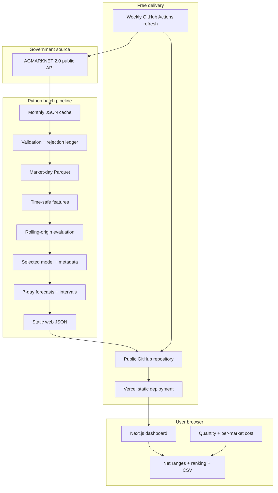
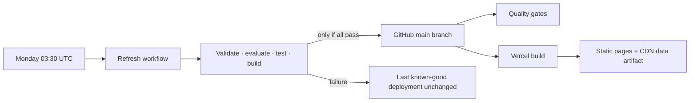

# Architecture

## Production shape

MandiLens is a batch data product with a static interactive frontend. Python owns source retrieval,
validation, analytical transformation, feature construction, chronological evaluation, model
selection, inference, and export. Next.js owns presentation and browser-only calculations that
depend on user assumptions.

## Boundaries

### Batch boundary

The training model never runs inside a request. Commodity, market, and horizon forecasts are
precomputed after each data refresh. This removes a Python hosting service, model cold starts,
cross-origin configuration, secret management, and a runtime failure boundary.

### Browser boundary

User-entered quantity and cost assumptions remain in local React state. The application converts
units, computes gross and net point/range estimates, ranks markets, and creates a local CSV Blob.
There is no API request, account, database write, analytics tracker, or persistence.

### Source-of-truth boundary

- Raw monthly responses and the retrieval manifest are the immutable input audit trail.
- `data/published/market_history.parquet` is the normalized analytical history.
- `reports/model_evaluation.json` is the model-selection evidence.
- `models/published/selected_model.joblib` is the fitted production bundle.
- `apps/web/public/data/mandilens.json` is the only production data contract consumed by the UI.

## Deployment topology

## Why there is no FastAPI service

Request-time inference creates no material value for the current feature set. Precomputed forecasts
cover every supported series and horizon, while quantity and transport costs affect only arithmetic
after inference. A separate API would make the free demo less reliable and would not improve model
quality or product capability.

## Why there is no database or authentication

The MVP has no saved comparisons, watchlists, alerts, preferences, feedback, or administrative
review state. Analytical time series fit Parquet better than a transactional database. Adding
PostgreSQL, an ORM, and authentication solely for stack breadth would add maintenance without a user
need.

## Security posture

- No application secret is required.
- No user or personal data is collected.
- No arbitrary user content is rendered.
- Static source links use safe external-navigation attributes.
- Content Security Policy restricts scripts, styles, images, fonts, connections, frames, and forms.
- Frame ancestry, MIME sniffing, referrer, cross-origin opener, and browser permission headers are
  explicitly restricted.
- Dependency updates are monitored monthly, and CI runs an npm vulnerability audit.
- Raw data and local deployment configuration are ignored by Git.

## Scalability boundary

The compact JSON is about 7.2 MB uncompressed and about 390 KB over the production connection. It
is appropriate for 21 series and client-side exploration. Nationwide or multi-commodity expansion
should move to partitioned static route artifacts or queryable object storage before the browser
contract grows substantially.
